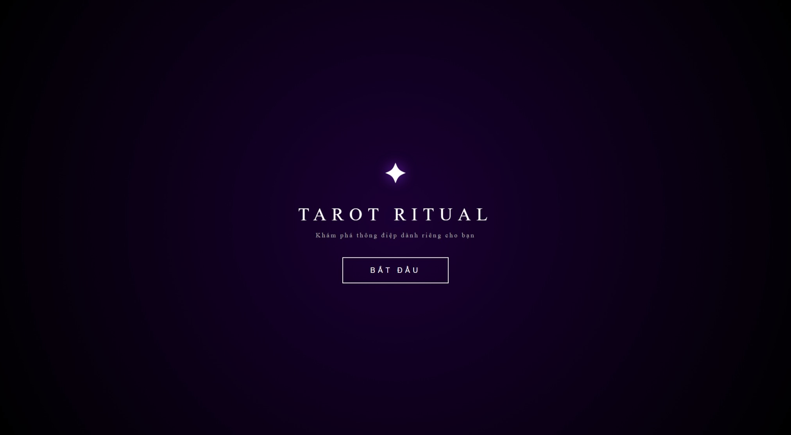
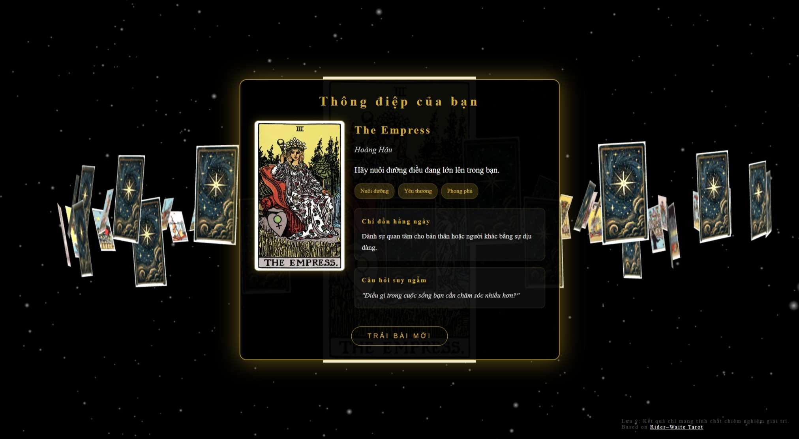

# 🔮 Tarot Ritual

Một trải nghiệm Tarot tương tác độc đáo trên web, kết hợp đồ họa 3D (Three.js) và công nghệ nhận diện cử chỉ tay (MediaPipe Hands).

## ✨ Tính năng chính

- **Không gian 3D huyền bí**: 78 lá bài Rider-Waite được sắp xếp trong không gian 3D với hiệu ứng ánh sáng và hạt (particles) lung linh.
- **Điều khiển bằng cử chỉ (Hand Tracking)**:
  - Sử dụng camera để nhận diện bàn tay.
  - **Tráo bài**: Chụm/mở ngón tay (Pinch) để xoay vòng bài.
  - **Chọn bài**: Chụm ngón cái và trỏ để "gắp" một lá bài từ không trung.
- **Hiệu ứng thị giác (VFX)**:
  - Bài bay và lật với hiệu ứng vật lý.
  - "Smash effect": Lá bài phóng to đập vào màn hình khi được chọn.
  - Hiệu ứng nổ hạt (explosion) khi mở bài.
- **Tối ưu**: Chạy mượt mà trên trình duyệt, tài nguyên MediaPipe được tải local để tăng tốc độ.

## 💡 Ý tưởng phát triển

Nếu bạn muốn phát triển tiếp, đây là một số gợi ý:

1.  **AI Reading**: Tích hợp OpenAI/Gemini API để giải nghĩa lá bài dựa trên câu hỏi của người dùng thực tế thay vì text cố định.
2.  **Nhiều trải bài (Spreads)**: Hiện tại chỉ rút 1 lá (Daily Card). Có thể thêm trải bài Celtic Cross, trải bài 3 lá (Quá khứ - Hiện tại - Tương lai).
3.  **Chế độ VR/AR**: Đưa trải nghiệm lên kính thực tế ảo để người dùng thực sự "bước vào" căn phòng Tarot.
4.  **Âm thanh (Soundscape)**: Thêm nhạc nền ambient và hiệu ứng âm thanh (SFX) khi bài bay, lật để tăng tính nhập vai.
5.  **Lưu lịch sử**: Lưu lại các lần rút bài vào LocalStorage để xem lại nhật ký.

---

_Dự án lấy cảm hứng từ bộ bài Rider-Waite Tarot kinh điển. Nội dung chỉ mang tính chất giải trí._

🔗 **Tham khảo**: [Rider–Waite Tarot on Wikipedia](https://en.wikipedia.org/wiki/Rider%E2%80%93Waite_Tarot)

© Bản quyền thuộc về [Ha Trong Nguyen](https://github.com/htrnguyen)
